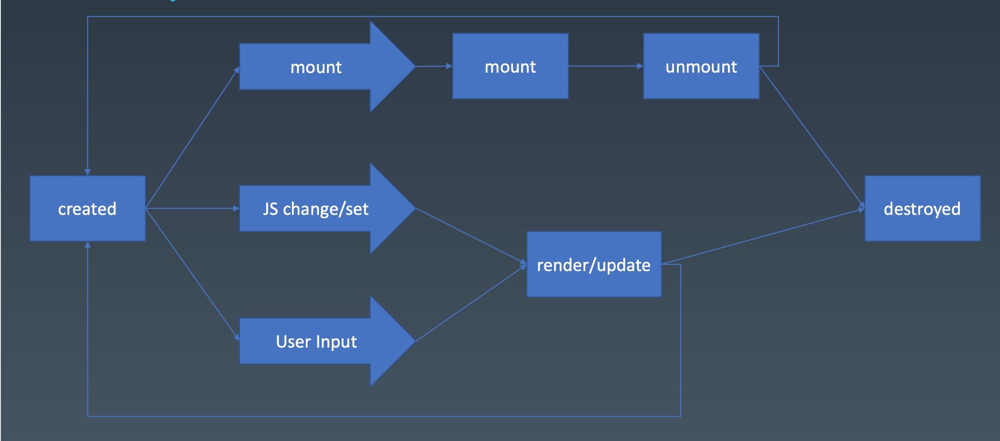

# 组件的基本概念和基本组成知识
## 组件化基础
* 对象
  * properties
  * methods
  *  inherit

* 组件
  * properties
  * methods
  * inherit
  * attribute
  * config & state
  *  event
  *  lifecycle
  * children
property 与 attribute 的区别： attribute 强调描述性 ； property 强调从属关系
```
// Attribute
<my-component attribute=="v">
myComponent.getAttribute('a');
myComponent.setAttribute('a', 1);

// property
myComponent.a = 1;

```
## 组件包含：
1、Input （输入），用户输入
2、组件内部：包含状态和内部树形子节点
3、组件的描述形型代码
4、来自上一级代码的属性或者函数
5、向外传递的函数

## 关于组件的生命周期
参考目前的流行框架： React 、 Vue

1、created 组件初始化
2、mount 组件 DOM 挂载
3、 render/update 在遇见变更时，更新和渲染
4、unmount组件DOM销毁
4、组件销毁


## 个人感受
组件化，也可以说是一种更高级的可预测的代码组件方式。最近，在工作中，就陷入了组件化的误区。我的划分一开始是参照业务组件和功能型组件来进行开发的。在使用 React Hooks 进行开发的时候，代码组织混乱，没有去仔细考虑组件的输入输出，以及内部的children组织方式，导致了很多问题。经过了这周课程，对组件化的认识更加清晰明了。